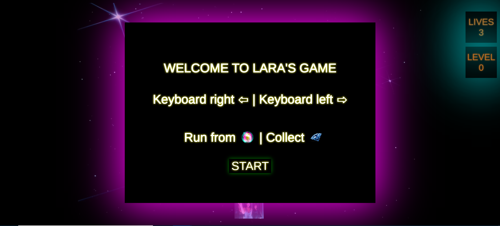
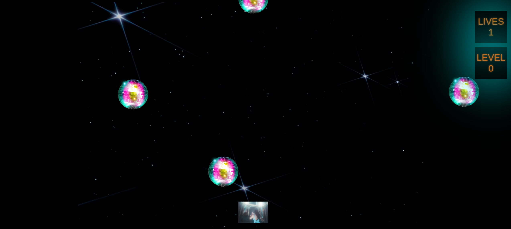
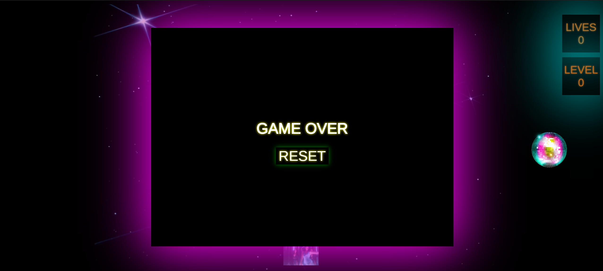

# Lara's Object Oriented Programming Game Project

# Game Rules 

The player starts the game with 3 lives. The player's avatar is at the bottom of the screen and can be moved right and left with the arrow keys. 

Your goal, as the player, is to keep Dua Lipa (your avatar) dancing as long as possible. 
The disco balls will take lives, whereas the diamonds will grant lives. So, try to run from the disco balls and catch the diamonds. 

Please note that in time, your level will increase and similarly the speed of the enemies coming down from the sky will increase. 

GOOD LUCK! 

# Inspiration 

The visuals of the game are inspired by the music video of Dua Lipa's recent song called Levitating, which plays as the background music. 
Please see: https://www.youtube.com/watch?v=TUVcZfQe-Kw 

# 1) Modifications 
- Added a start page, button, and a short set of instructions. 
- Added lives. 
- Added levels to the game which will increase with time. 
- Added a feature so that as the level increases bonus items (diamonds) will start falling from the sky which will grant lives instead of taking them as enemies (disco balls) do. 
- Added a feature so that as the level increases the speed at which items fall from the sky  will increase. 
- Modified the game width, height, background, player and enemy icons. 
- Added an end page along with a reset button. 
- Added soundtrack and sound effects. 

# 2) Screenshots 

# 3) Netlify Link 

### Submission

- Open a PR, as you normally would, against the parent repository.
- Be sure to add screenshot(s) to the PR.
- Deploy the project to Netlify
  - View this guide: https://docs.google.com/document/d/1J7ff9h77RMrQadgCM54eziW_Rj5_PAHYpQHYjf2ojZU/edit?usp=sharing

// ## Useful Links
// - https://javascript.info/keyboard-events
